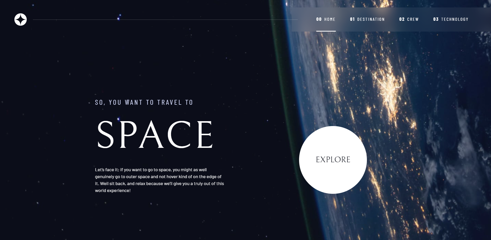

# Frontend Mentor - Space tourism multi-page website solution

This is a solution to the [Space tourism multi-page website challenge on Frontend Mentor](https://www.frontendmentor.io/challenges/space-tourism-multipage-website-gRWj1URZ3). Frontend Mentor challenges help you improve your coding skills by building realistic projects.

## Table of contents

- [Overview](#overview)
  - [Screenshot](#screenshot)
  - [Links](#links)
- [My process](#my-process)
  - [Built with](#built-with)
  - [What I learned](#what-i-learned)
- [Author](#author)

## Overview

### Screenshot

### Links

- Solution URL: [Solution Page](https://www.frontendmentor.io/solutions/responsive-multipage-website-using-flexbox-and-grid-nUP91PyhBF)
- Live Site URL: [Live Site](https://attia-mahmoud.github.io/space_travel/)

## My process

### Built with

- Semantic HTML5 markup
- CSS custom properties
- Flexbox
- Grid
- Mobile-first Approach

### What I learned

Custom CSS Variables
Grid Properties
clamp and minmax CSS properties

## Author

- Website - [Mahmoud Attia](https://www.mahmoudattia.com)
- Frontend Mentor - [@mahmoud-attia](https://www.frontendmentor.io/profile/attia-mahmoud)
